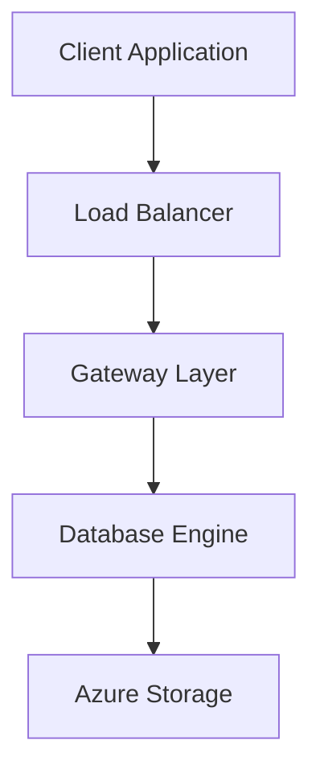

# Azure SQL Architecture Overview

## 1. Service Tiers

### Deployment Options
- Azure SQL Database (PaaS)
- Azure SQL Managed Instance
- Azure SQL VM (IaaS)

## 2. Infrastructure Components

### Physical Architecture


## 3. Key Components

### Database Engine
````sql
-- Check Azure SQL version and edition
SELECT @@VERSION AS ServerVersion,
       SERVERPROPERTY('EngineEdition') AS EngineEdition,
       DATABASEPROPERTYEX(DB_NAME(), 'ServiceObjective') AS ServiceTier;
GO
````

### Storage Management
- Automatic backup
- Point-in-time restore
- Geo-replication
- Auto-failover groups

## 4. Security Architecture

### Defense in Depth
```
Network Security
└── Firewall Rules
    └── Authentication
        └── Authorization
            └── Data Protection
```

### Built-in Security Features
- Always Encrypted
- Dynamic Data Masking
- Row-Level Security
- TDE (Transparent Data Encryption)

## 5. Performance Tiers

### Service Tiers
```
Business Critical
├── General Purpose
└── Hyperscale
```

### Resource Governance
````sql
-- Check resource usage
SELECT 
    AVG_CPU_PERCENT,
    AVG_DATA_IO_PERCENT,
    AVG_LOG_WRITE_PERCENT
FROM sys.dm_db_resource_stats;
GO
````

## 6. Monitoring & Management

### Azure Monitor Integration
- Metrics collection
- Log Analytics
- Alerts
- Diagnostic settings

### Automated Management
- Auto-patching
- Auto-tuning
- Automatic Plan Correction
- Intelligent Insights

To connect using Azure CLI:
```bash
az sql db connect \
  --server myserver \
  --database mydatabase \
  --resource-group myresourcegroup
```

For monitoring setup:
````sql
-- Enable Query Store
ALTER DATABASE current
SET QUERY_STORE = ON;
GO
````