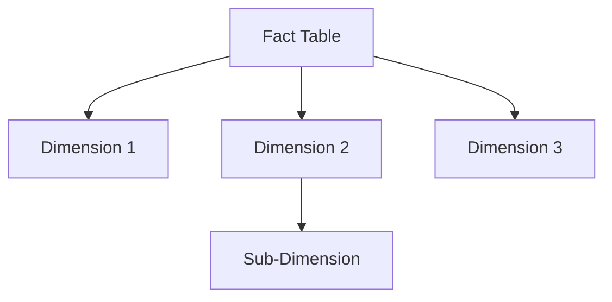

# Data Modeling Best Practices

## 1. Core Concepts

### Star Schema vs. Snowflake Schema


### Fact Tables
- Contain measurable events
- Typically numeric values
- Foreign keys to dimensions
- Usually tall and narrow

### Dimension Tables
- Contain descriptive attributes
- Text and categorical data
- Primary keys
- Usually short and wide

## 2. Implementation Example

````sql
-- Dimension: Time
CREATE TABLE DimDate (
    DateKey INT PRIMARY KEY,
    FullDate DATE,
    Year INT,
    Month INT,
    MonthName VARCHAR(10),
    Quarter INT
);

-- Dimension: Product
CREATE TABLE DimProduct (
    ProductKey INT PRIMARY KEY,
    ProductID VARCHAR(20),
    ProductName VARCHAR(100),
    Category VARCHAR(50),
    SubCategory VARCHAR(50)
);

-- Fact: Sales
CREATE TABLE FactSales (
    SalesKey INT IDENTITY(1,1) PRIMARY KEY,
    DateKey INT FOREIGN KEY REFERENCES DimDate(DateKey),
    ProductKey INT FOREIGN KEY REFERENCES DimProduct(ProductKey),
    Quantity INT,
    Amount DECIMAL(18,2)
);
````

## 3. Best Practices

### Naming Conventions
- Fact tables: Start with "Fact"
- Dimension tables: Start with "Dim"
- Keys: EntityNameKey
- Consistent casing

### Key Design
````sql
-- Surrogate Keys
ProductKey INT IDENTITY(1,1)

-- Natural Keys
ProductID VARCHAR(20)

-- Foreign Keys
ProductKey INT FOREIGN KEY
````

### Relationships
- One-to-many (most common)
- Many-to-many (bridge tables)
- Slowly Changing Dimensions (SCD)

## 4. Performance Considerations

### Indexing Strategy
````sql
-- Clustered index on date for fact table
CREATE CLUSTERED INDEX IX_FactSales_Date 
ON FactSales(DateKey);

-- Covering index for common queries
CREATE NONCLUSTERED INDEX IX_Sales_Product 
ON FactSales(ProductKey)
INCLUDE (Quantity, Amount);
````

### Partitioning
````sql
-- Partition by date
CREATE PARTITION FUNCTION pfSales(datetime)
AS RANGE RIGHT FOR VALUES ('2023-01-01', '2024-01-01');
````

## 5. Tools
- Visual Studio Database Projects
- Azure Data Studio
- dbdiagram.io
- Power BI Desktop
- SQL Server Management Studio

To validate model in VS Code:
```bash
sqlcmd -S localhost -U sa -P YourPassword -i "/Users/fttg/models/schema.sql"
```