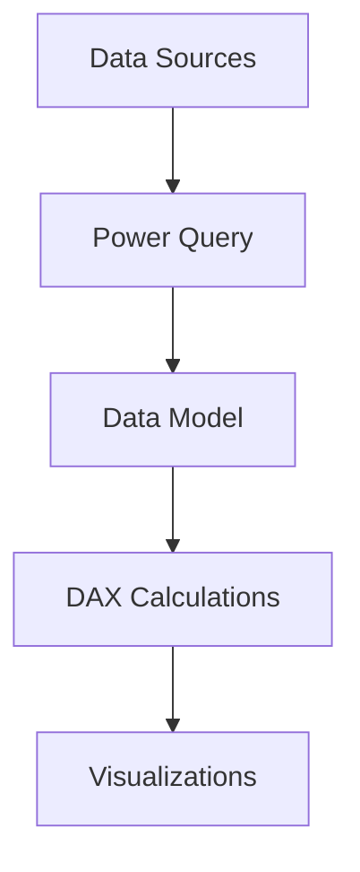

# Power BI Architecture Overview

## 1. Core Components

### Front-End Layer
- Power BI Desktop
- Power BI Service (cloud)
- Power BI Mobile
- Power BI Embedded

### Data Layer


## 2. Key Components

### Power Query (M Language)
- ETL processing
- Data transformation
- Source connectivity
- Data cleansing

### DAX (Data Analysis Expressions)
```dax
// Example DAX measure
Total Sales = SUM(Sales[Amount])

// YTD calculation
YTD Sales = 
TOTALYTD(
    SUM(Sales[Amount]),
    'Date'[Date]
)
```

### Vertipaq Engine
- In-memory columnar storage
- Data compression
- Relationship handling
- Query optimization

## 3. Data Flow

### Import Mode
```
Source → Power Query → Data Model → Reports
```

### DirectQuery Mode
```
Reports ←→ Data Model ←→ Source
```

### Composite Mode
```
Import Data    →→ Data Model
DirectQuery    ←→ Data Model
```

## 4. Security Model

### Row-Level Security (RLS)
```dax
// Example RLS role
[Region] = USERPRINCIPALNAME()
```

### Components
```
Workspace
└── Dataset
    ├── Reports
    ├── Dashboards
    └── Security Roles
```

## 5. Deployment Pipeline

```
Development → Test → Production
```

### Gateway Types
- Personal
- Enterprise
  - Standard mode
  - Personal mode

## 6. Refresh Architecture
```
Scheduled
├── Import datasets
├── DirectQuery cache
└── Automatic page refresh
```

To monitor in Power BI Service:
1. Capacity Metrics
2. Dataset Impact Analysis
3. Usage Metrics
4. Lineage View

For detailed documentation, refer to the [Power BI documentation](https://docs.microsoft.com/en-us/power-bi/).