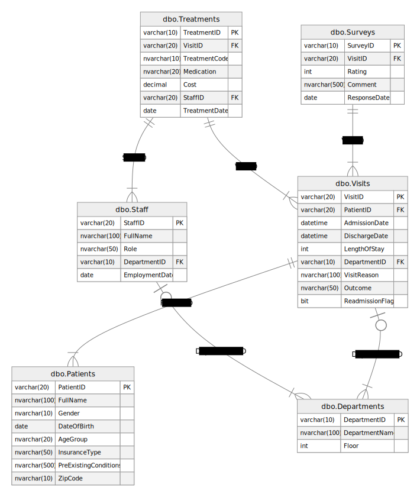

Your ER diagram (chart.svg) represents a **star schema** for the following reasons:

---

### 1. **Central Fact Tables**
- **Visits** and **Treatments** are at the center of the schema. These tables store transactional (fact) data, such as each hospital visit or treatment event.

### 2. **Surrounding Dimension Tables**
- **Patients**, **Departments**, **Staff**, and **Surveys** are dimension tables. They provide descriptive context for the facts (e.g., patient details, department info, staff roles).

### 3. **Direct Relationships**
- Each fact table (e.g., Visits, Treatments) has **direct foreign key relationships** to its dimension tables:
  - `Visits` links to `Patients` (via PatientID) and `Departments` (via DepartmentID).
  - `Treatments` links to `Visits` (via VisitID) and `Staff` (via StaffID).
  - `Surveys` links to `Visits` (via VisitID).

### 4. **No Further Normalization**
- Dimension tables are **not further normalized** (i.e., you don’t see, for example, a separate Address table for Patients or a separate Role table for Staff). Each dimension is a single table.

### 5. **Spoke-and-Hub Pattern**
- The diagram visually shows a **hub-and-spoke** (star) pattern: fact tables in the center, dimension tables radiating outward.

---

## **Summary Table**

| Fact Table   | Dimension Tables Linked           |
|--------------|----------------------------------|
| Visits       | Patients, Departments            |
| Treatments   | Visits, Staff                    |
| Surveys      | Visits                           |

---

## **Conclusion**

**This is a star schema** because:
- Fact tables are at the center.
- Dimension tables are directly connected to the facts.
- Dimensions are not normalized into sub-dimensions (no snowflake).
- The structure is optimized for analytical queries and reporting.

**In contrast, a snowflake schema would have further normalized dimension tables (e.g., splitting Department into Department and Floor tables), which is not the case here.**

---
## Why Surveys can be both Star or SNowflake shema (depending on analytical goals)
Great question! In your schema, **Surveys** could technically be modeled as either a fact table or a dimension table, depending on your analytical goals and how you use the data.

### Why "Surveys" is Often Not Modeled as a Fact Table

**1. Fact Table Definition:**  
A fact table typically records **measurable events** (transactions) that occur in the business process, such as visits, treatments, or sales. These events are often the focus of analysis (e.g., "How many visits?", "What is the total cost of treatments?").

**2. Survey Table Characteristics:**  
- The **Surveys** table records feedback or satisfaction data **about** a fact event (the visit).
- Each survey is usually **tied to a single visit** (1:1 or 0:1 relationship).
- It contains attributes like rating, comment, and response date, which are **descriptive or qualitative** rather than quantitative measures of business process activity.

**3. Analytical Focus:**  
- If your main analysis is on **visits** and you want to include survey data as an attribute of the visit (e.g., average satisfaction per department), then survey data is often treated as a **dimension or a satellite table**.
- If you want to analyze surveys as the main event (e.g., "How many surveys were submitted?", "What is the average rating?"), you could treat it as a **fact table**.

---

### In Your Schema

- **Visits** is the central fact table (the main event).
- **Surveys** is linked to **Visits** (not the other way around).
- **Surveys** provides additional context or attributes about the visit, not about a separate business process.

---

### When Would Survey Be a Fact Table?

- If you want to analyze survey submissions as the **primary event** (e.g., in a customer feedback system where each survey is a transaction), then it would be a fact table.
- If you have multiple surveys per visit or want to aggregate survey data independently, it makes sense as a fact.

---

## **Summary Table**

| Table   | Typical Role | Why? |
|---------|--------------|------|
| Visits  | Fact         | Main measurable event (admissions, discharges, etc.) |
| Surveys | Dimension or Satellite | Describes/qualifies the visit, not a primary business event |

---

## **Conclusion**

**In your schema, Surveys is not a fact table because it describes or qualifies the main event (the visit) rather than being a primary, measurable business event itself.**  
If your analysis shifts to focus on surveys as the main event, you can model it as a fact table. For most healthcare analytics, visits and treatments are the core facts.