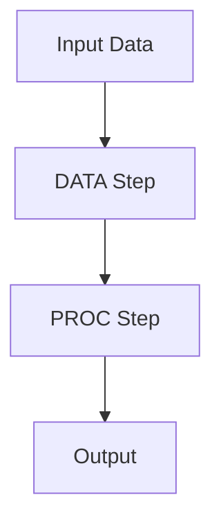

# SAS Programming Architecture Overview

## 1. Core Components

### Base SAS
- SAS Program Editor
- Log Window
- Output Window
- Results Viewer

### Processing Layers


## 2. Key Components

### DATA Step Processing
````sas
/* filepath: /Users/fttg/fttg_workspace/sas/example.sas */
DATA work.employees;
    SET raw.employees;
    /* Data transformation logic */
    salary_category = 
        IF salary > 50000 THEN 'High'
        ELSE 'Standard';
RUN;
````

### PROC Step Processing
````sas
/* Basic statistical analysis */
PROC MEANS DATA=work.employees;
    VAR salary;
    CLASS department;
RUN;
````

## 3. Memory Management

### SAS Work Library
- Temporary storage
- Session-specific
- Cleared after session ends

### Permanent Libraries
```
SASLib
├── Data Sets
├── Catalogs
├── Views
└── Indexes
```

## 4. Processing Flow

### Input → Processing → Output
```
Raw Data → DATA Step → PROC Step → Results
```

### Macro Processing
````sas
/* Example macro */
%MACRO calculate_stats(dataset, var);
    PROC MEANS DATA=&dataset;
        VAR &var;
    RUN;
%MEND;
````

## 5. File Structure

### Components
```
SAS Environment
├── autoexec.sas
├── config.sas
├── sasuser
└── work
```

### Libraries
- Work (temporary)
- Sasuser (permanent)
- Custom libraries

## 6. Key Features

### Performance Options
- Compression
- Indexing
- Threading
- Buffering

### Security
- Authentication
- Authorization
- Row-level security
- Column-level security

To monitor in SAS:
1. Log file analysis
2. Performance statistics
3. Resource utilization
4. Error tracking

For detailed documentation, refer to the [SAS documentation](https://documentation.sas.com/).