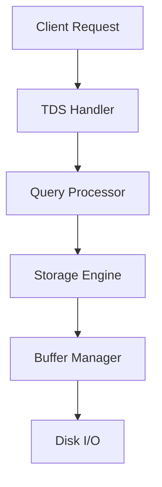

# SQL Server Architecture Overview

## 1. Key Components

### Client Layer
- Query submissions via:
  - SSMS (SQL Server Management Studio)
  - VS Code with SQL extensions
  - Application code
  - Command-line tools (`sqlcmd`)

### Database Engine
````sql
-- Check SQL Server version and edition
SELECT @@VERSION AS ServerVersion;
GO

-- View active connections
SELECT session_id, login_time, host_name
FROM sys.dm_exec_sessions
WHERE is_user_process = 1;
GO
````

### Storage Components
1. **Data Files**
   - Primary (`.mdf`)
   - Secondary (`.ndf`)
   - Log files (`.ldf`)

2. **System Databases**
   ```
   master  → Server configuration
   model   → Template for new DBs
   msdb    → Jobs and backups
   tempdb  → Temporary storage
   ```

## 2. Process Flow



## 3. Memory Management

### Buffer Pool
````sql
-- View buffer usage
SELECT 
    database_id,
    COUNT(*) AS cached_pages
FROM sys.dm_os_buffer_descriptors
GROUP BY database_id
ORDER BY cached_pages DESC;
GO
````

### Plan Cache
````sql
-- View execution plan cache
SELECT 
    usecounts,
    size_in_bytes,
    cacheobjtype
FROM sys.dm_exec_cached_plans;
GO
````

## 4. Security Model
```
Instance Level → Server Login
Database Level → Database User
Schema Level   → Object Permissions
```

For detailed server information:
````sql
SELECT 
    SERVERPROPERTY('ProductVersion') AS Version,
    SERVERPROPERTY('Edition') AS Edition,
    DB_NAME() AS CurrentDatabase,
    @@SPID AS SessionID;
GO
````